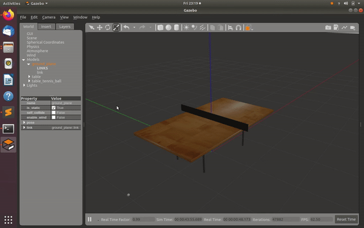
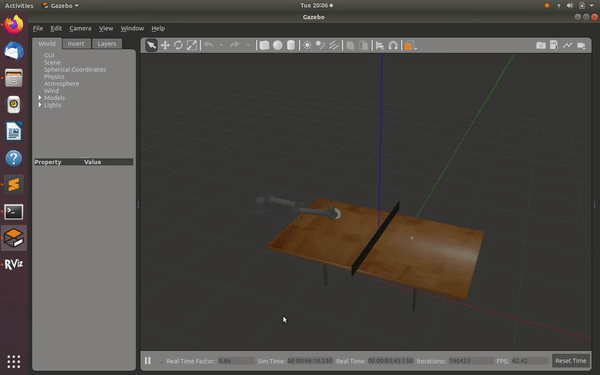
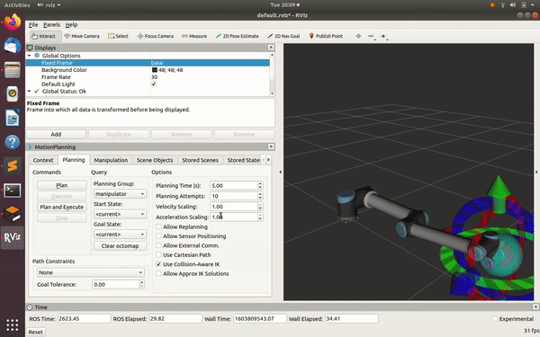
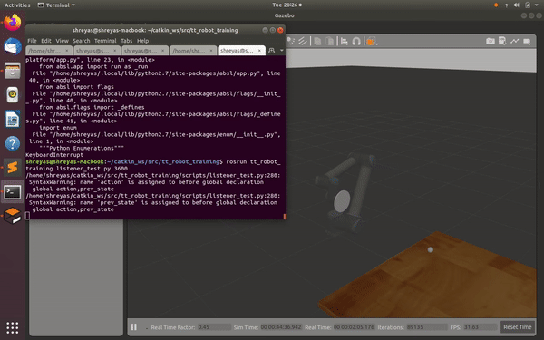

# Teachin a UR10 arm  how to play Table Tennis ( In Progress ) 
This project attempts to use reinforcement learning using an actor critic model to teach a robotic arm how to play table tennis.

# Requirements

  - ROS Distro: Melodic
  - Gazebo version 9.14.0

# Setup
## World File

  

The world file ( tt_robot/worlds/Table_Tennis.world ) was created using an empty world with two models. The table is a modification of 
the table model in the the standard gazebo models file. The table tennis ball was created to be the size of a standard table tennis ball 
with friction coeeficient(0.3) and coefficient of restitution(0.6) to mimic a real table tennis ball. The ball model has a plugin 
( gazebo_plugin_tutorial/model_push.cc )  that resets it pose and velocity after a certain time interval ( 2 seconds ). It is currently set to 
a single pose and trajectory which shall be extended to a random selection from a predefined sample set.

## Setting up UR10 Arm

  

<code> roslaunch tt_robot tt_robot.launch </code>

A UR10 arm was used for higher reach. A custom end effector was added to simulate the paddle ( https://gramaziokohler.github.io/compas_fab/latest/examples/03_backends_ros/07_ros_create_urdf_ur5_with_measurement_tool.html ) and a new urdf was created ( tt_robot/urdf/tt_robot.xacro ). A custom moveit package ( https://gramaziokohler.github.io/compas_fab/latest/examples/03_backends_ros/08_ros_create_moveit_package_from_custom_urdf.html ) was also created for the custom urdf.
## Motion Planning 

  

<code> roslaunch tt_robot_moveit_config tt_robot_planning_execution.launch </code>

Standard motion planning is not done in real time whereas for reinforcement learning we require the arm to move instantaneously based on current available data. Therefore we use the moveit/moveit_ros/moveit_servo package ( only available in ros melodic ) which was previously know as jog arm package. Using the /moveit/moveit_ros/moveit_servo/launch/spacenav_teleop_tools.launch file we can control the end effector in six degrees of freedom by providing the required velocity in the required direction ( x,y,z and r,p,y ) and publishing on /servo_server/delta_twist_cmds.

Use rviz to shift to a position where all joints are not zero:
<code> roslaunch tt_robot_moveit_config moveit_rviz.launch </code>

Switch from the default controllers:
<code>
rosservice call /controller_manager/switch_controller "start_controllers:
'joint_group_position_controller'
stop_controllers:
'arm_controller'
strictness: 2"
</code>

Run the spacenav launch file:
<code>roslaunch moveit_servo spacenav_cpp.launch </code>

# Reinforcement Learning
## State Space
Defined by 9 variables. 6 variables defining the x,y,z and roll,pitch,yaw of the end effector using tf tranformations. 3 variables defining the x,y,z of the table tennis ball using gazebo/get_model_state.
## Action Space 
Defined by 6 variables. The velocity you want to push the end effector in the x,y,z and r,p,y directions. It is currently bucketed to [-2,2] for all directions.
## Model 
As the state and action spaces are both continous we use an Actor Critic Model where the Actor takes in the state space and outputs the action and the Critic takes in the action and predicts the reward.
## Learning stages 
The training file is saved in tt_robot_training/scripts/listener_test.py
### Stage 1 : Initial Position ( In Progress ) 

  

As going to extreme ends might result in a position limit or singularity the first stage penalizes the robot if it tries to stray from an initial position ( defined as [0.45,0,0.4] meters from the base ). The data to be trained on for stage 1 is reduced by reducing the state and action variables so that learning can be faster.

  - Reward Function : 1 - cartesian distance form initial position
  - State Space : All values except x,y,z of the robot arm are zeroed out ( we would like the paddle to remain flat and the ball cordinates are irrelevant )
  - Action Space : Only the x,y,z velocities are taken into account ( paddle remains flat ).
### Stage 2 : Reaching for the ball
Touching the ball with the paddle will result is a discrete reward and minimizing the distance from the ball will result in a continous smaller reward( to guide the paddle to the ball ).
### Stage 3 : Returning the ball
A similar approach shall be followed with contact with the other side of the table. A discrete reward shall be awarded on contact with the other side of the table and a continous award shall guide it towards the center of the table.

